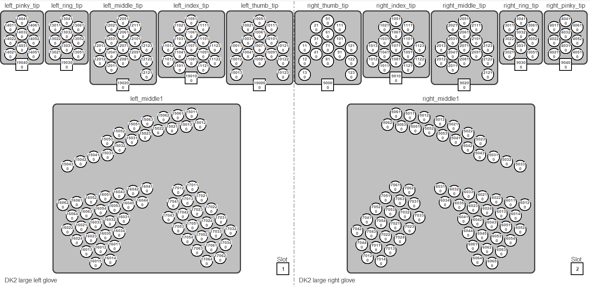

# HaptX Glove Messages

These messages can be used to actuate the HaptX Gloves.

These are the 8 topics and their associated message types:
- `/haptx/rh/brake_state` and `/haptx/lh/brake_state`
    - __Message Type:__ `FingerBrakeState`
    - Can be used to activate/deactivate the finger brakes of the HaptX Glove
- `/haptx/rh/tactor_state` and `/haptx/lh/tactor_state`
    - __Message Type:__ `TactorState`
    - Can be used to inflate/deflate individual tactors
- `/haptx/rh/tactor_group_state` and `/haptx/lh/tactor_group_state`
    - __Message Type:__ `TactorGroupState`
    - Can be used to inflate/deflate predefined groups of tactors
- `/haptx/rh/hand_state` and `/haptx/lh/hand_state`
    - __Message Type:__ `FullHandState`
    - Can be used to activate the figner brakes and inflate/deflate individual tactors or tactor groups

<br>

## haptx_interfaces/FingerBrakeState
```
string[] name
bool[] activated
```


The FingerBrakeState message contains of:
- A list of strings called `name` which specifies the names of the finger brake you want to activate/deactivate
    - Options:
        - Right Hand:
            - Thumb: `'rh_th'`
            - First Finger: `'rh_ff'`
            - Middle Finger: `'rh_mf'`
            - Ring Finger: `'rh_rf'`
            - Little Finger: `'rh_lf'`
        - Left Hand:
            - Thumb: `'lh_th'`
            - First Finger: `'lh_ff'`
            - Middle Finger: `'lh_mf'`
            - Ring Finger: `'lh_rf'`
            - Little Finger: `'lh_lf'`

- A list of booleans called `activated` which specifies the state of each finger brake specified in the `name` list
    - Options:
        - `True`
        - `False`


__Example Usage:__

When published to the `haptx/rh/brake_state` topic, this message will activate the finger brake on the Right Hand First Finger and Right Hand Middle Finger, and deactivate the finger brake on the Right Hand Little Finger
```
msg = FingerBrakeState()
msg.name = ['rh_ff', 'rh_mf', 'rh_lf']
msg.activated = [True, True, False]
```

<br>

## haptx_interfaces/TactorState
```
int32[] tactor_id
float64[] inflation
```


The TactorState message contains of:
- A list of tactor IDs called `tactor_id` which specifies the IDs of the tactors you want to inflate/deflate
    - Options:
        - 

- A list of floats called `inlfation` which specifies how much to inflate each tactor specified in the `tactor_id` list
    - The inflation value should be a float in the range of [0,1]
    - The inflation value specifies the proportion of the max inflation
    - Values below 0.0 will lead to zero inflation, and values above 1.0 will lead to max inflation


__Example Usage:__

When published to the `haptx/rh/tactor_state` topic, this message will inflate tactor 1011 to 0.7\*MAX_INFLATION, tactor 1023 to 1.0\*MAX_INFLATION, etc.
```
msg = TactorState()
msg.tactor_id = [1011, 1023, 1038, 1237]
msg.inflation = [0.7, 1.0, 0.0, 0.2]
```

<br>

## haptx_interfaces/TactorGroupState
```
string[] tactor_group
float64[] inflation
```


The TactorGroupState message contains of:
- A list of strings called `tactor_group` which specifies the names of the tactor groups you want to inflate/deflate
    - Options:
        - Right Hand:
            - Thumb: `'rh_th'`
            - First Finger: `'rh_ff'`
            - Middle Finger: `'rh_mf'`
            - Ring Finger: `'rh_rf'`
            - Little Finger: `'rh_lf'`
            - Upper Palm: `'rh_palm_top'`
            - Lower Palm (side closer to thumb): `'rh_palm_th'`
            - Lower Palm (side closer to little finger): `'rh_palm_lf'`
            - Full Palm: `'rh_palm_full'`
        - Left Hand:
            - Thumb: `'lh_th'`
            - First Finger: `'lh_ff'`
            - Middle Finger: `'lh_mf'`
            - Ring Finger: `'lh_rf'`
            - Little Finger: `'lh_lf'`
            - Upper Palm: `'lh_palm_top'`
            - Lower Palm (side closer to thumb): `'lh_palm_th'`
            - Lower Palm (side closer to little finger): `'lh_palm_lf'`
            - Full Palm: `'lh_palm_full'`

- A list of floats called `inflation` which specifies how much to inflate each tactor group specified in the `tactor_group` list
    - The inflation value should be a float in the range of [0,1]
    - The inflation value specifies the proportion of the max inflation
    - Values below 0.0 will lead to zero inflation, and values above 1.0 will lead to max inflation


__Example Usage:__

When published to the `haptx/lh/tactor_group_state` topic, this message will inflate the tactors on the Left Hand Thumb to 0.4\*MAX_INFLATION, the tactors on the Left Hand Middle Finger to 0.67\*MAX_INFLATION, etc.
```
msg = TactorGroupState()
msg.tactor_group = ['lh_th', 'lh_mf', 'lh_rf']
msg.inflation = [0.4, 0.67, 0.0]
```

<br>

## haptx_interfaces/FullHandState
```
FingerBrakeState brakes
TactorState tactors
TactorGroupState tactor_groups
```


The TactorGroupState message contains of:
- A FingerBrakeState message called `brakes` which can be used to activate/deactivate the finger brakes
- A TactorState message called `tactors` which can be used to inflate/deflate individual tactors
- A TactorGroupState message called `tactor_groups` which can be used to inflate/deflate tactor groups


Any of these fields are optional. For example, if you only specify `tactor_groups`, no finger brakes will be activated/deactivated.

If the `tactors` field specifies values that are contradicted by values in the `tactor_groups` field, the values in the `tactor_groups` field will take precedence.


__Example Usage:__

When published to the `haptx/rh/hand_state` topic, this message will:
- Activate the finger brakes on the Right Hand First Finger and Right Hand Middle Finger, and deactivate the finger brakes on the Right Hand Little Finger
- Inflate the tactors on the Right Hand Ring Finger to 0.81\*MAX_INFLATION and the tactors on the Right Hand Little Finger to 0.12\*MAX_INFLATION
```
msg = FullHandState()
msg.brakes.name = ['rh_ff', 'rh_mf', 'rh_lf']
msg.brakes.activated = [True, True, False]

msg.tactor_groups.tactor_group = ['rh_rf', 'rh_lf']
msg.tactor_groups.inflation = [0.81, 0.12]
```